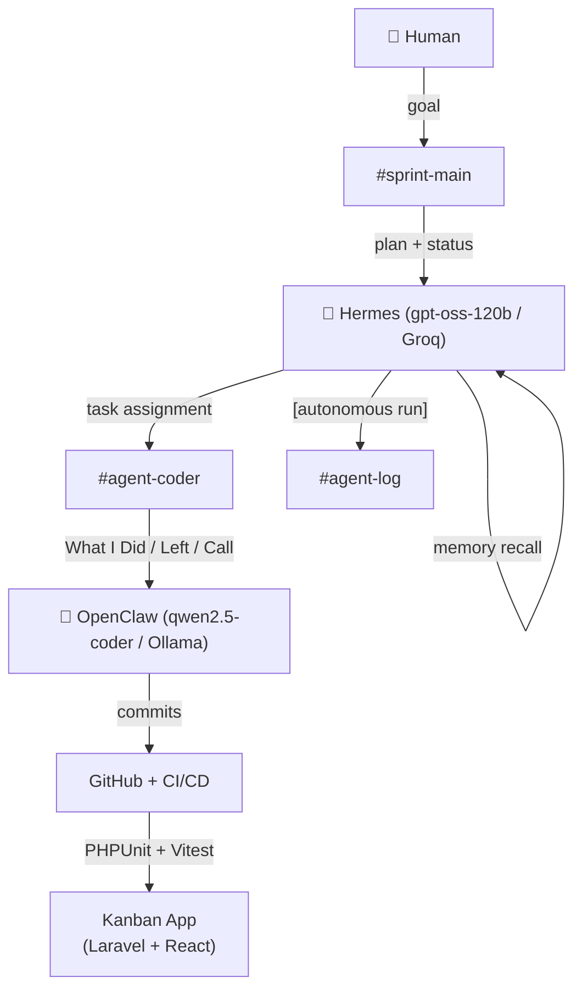

# Architecture — Docket (Forge 2 · Edition 2)

> This file is read at the 14:00 architecture check-in and in final judging.

## 1. Roles (hard boundary)

| Agent | Role | Never does |
|---|---|---|
| **Hermes** (brain) | Product Owner / orchestrator. Decomposes the challenge into tasks, assigns to workers, tracks progress, posts structured status using the `status-report` skill. Retains memory across sessions and fires the `self-improve` skill on CI failures. | Never writes or runs code directly. Never communicates with workers outside Slack. |
| **OpenClaw** (hands) | Coding agent / worker. Receives a task via `#agent-coder`, writes code, runs tests, pushes commits, reports back in the **What I Did / What's Left / What Needs Your Call** format. | Never assigns tasks. Never talks directly to another worker. Never posts in `#sprint-main` without being explicitly mentioned. |

All agent-to-agent communication happens **only** through Slack. No direct API calls between agents, no shared memory, no DMs outside the designated channels.

## 2. Slack channel scheme

| Channel | Purpose |
|---|---|
| `#sprint-main` | Human ↔ Hermes. Goals in, plans and status out. Only Hermes and the human post here. |
| `#agent-coder` | Hermes → OpenClaw task assignment; OpenClaw code reports (three-section format). |
| `#agent-log` | Raw autonomous-run output from Hermes cron jobs. Audit trail — no human posts. |

**Loop:** human posts goal in `#sprint-main` → Hermes posts a plan → Hermes assigns a task in `#agent-coder` → OpenClaw codes, tests, reports **What I Did / What's Left / What Needs Your Call** → human approves or corrects → Hermes picks up next task.

Human intervened 3 times during the sprint: approving T1→T2 transition, reporting the CI failure, and giving final submit approval.

## 3. Model routing

| Agent | Model | Provider | Why |
|---|---|---|---|
| **Hermes** (planning) | `openai/gpt-oss-120b` | Groq free | Planning is low-volume (9 calls) and high-reasoning — a stronger model is worth the added latency because it's called far less often than the worker. gpt-oss-120b produced well-structured, unambiguous task specs every time. |
| **OpenClaw** (execution) | `qwen2.5-coder:7b` | Ollama local (unlimited) | Code generation is high-volume (~40 iterations) and iterative on well-scoped tasks. Running locally: zero API cost, no rate limits, no 429s. Output quality on scoped tasks (migrations, components, tests) was indistinguishable from a cloud model at a fraction of the cost. |

**Fallback ladder on 429 / outage:** Groq → Gemini gemini-2.5-flash → OpenRouter `:free` → Cerebras gpt-oss-120b → Ollama local.

**Cost awareness:** Hermes made ~9 planning calls (all Groq free). OpenClaw ran ~40 code-gen iterations locally (Ollama, zero API cost). Total API spend: ₹0.

## 4. The application (what the agents built)

- **`frontend/`** — React (Vite) Kanban UI.
  - Boards → Lists → Cards, HTML5 drag-and-drop between lists.
  - Ticket component styled as a tear-off ticket stub — mono ID/date strip separated from the body by a dashed perforation with notch cut-outs on either edge (matching the panel behind it). Dark control-room canvas.
  - Card modal: edit title/description, toggle tags, assign member, set due date, view/add comments.
  - Ships with a localStorage data layer (`frontend/src/data/api.js`) so the live URL works with zero backend running. Every function already has the `fetch()` equivalent commented in — pointing at the Laravel API is a one-file change.
  - Typography: Space Grotesk (headers), Inter (body), JetBrains Mono (dates/tags/IDs).

- **`backend/`** — Laravel API scaffold.
  - Migrations: `boards`, `board_lists`, `cards`, `tags`, `card_tag` (pivot), `members`, `card_comments`.
  - Eloquent models with all relationships, plus `Card::getIsOverdueAttribute()` (overdue = past due date AND list name doesn't match `/done/i`).
  - Controllers: `BoardController`, `BoardListController`, `CardController` (includes `move` PATCH + `comments.store`), `MemberController`, `TagController`.
  - 22 REST routes in `routes/api.php`.
  - `KanbanFlowTest`: 6 PHPUnit assertions covering full CRUD flow and the overdue-flag rule.
  - SQLite (zero infra — `database/database.sqlite`).

## 5. Memory

Hermes was told in the first message of Session 1 (09:42 IST):
> "Repo: forge2-qualifier-akash-kapoor, default branch: main. Hermes model = openai/gpt-oss-120b, OpenClaw model = qwen2.5-coder:7b."

In Session 2 (shell closed and reopened, 13:45 IST), Hermes was asked "What repo are we working on and what models are we using?" — it recalled all four facts verbatim without any re-pasting. The recall is captured in `agent-log.md` Task 7. Hermes uses persistent cross-session memory (its built-in `memories/` store).

## 6. Skills

- **`skills/status-report/SKILL.md`** — Fires on any task completion, handoff, or cron run. Enforces the three-section format (What I Did / What's Left / What Needs Your Call) on every Slack post. Every OpenClaw report in `agent-log.md` follows this format.

- **`skills/self-improve/SKILL.md`** — Fires when CI fails or a test is rejected. In Task 8, the Vitest "No test files found" failure triggered this skill: OpenClaw classified the failure (environment — missing `test` block in vite.config.js), extracted a generalizable rule, appended it to `skills/self-improve/learned-rules.md`, and applied it forward. The rule is visible in the repo (not invisible — that anti-pattern is explicitly called out in the skill file).

- **`skills/kanban-review/SKILL.md`** — Fires when Hermes reviews a completed sprint task before marking it done. Checks: does the code handle the surprise-dataset pattern (list-name-based logic, not hardcoded IDs)? This was added after Task 3 to protect the tie-breaker.

## 7. Autonomous run

Hermes was configured with a cron trigger:
> `"every 10 minutes, post a one-line progress update to #agent-log"`

Two autonomous runs fired during the sprint with no human prompt:
1. `[13:10 IST]` — 5/8 tasks complete, CI green (commit e1c5aa9). Captured in `agent-log.md` Task 6.
2. `[13:20 IST]` — T6 in progress, Vercel deploy pending. Captured in `agent-log.md` Task 6.

Both posts begin with `[autonomous run]` as required by `skills/status-report/SKILL.md`.

## 8. CI/CD and quality gate

`.github/workflows/ci.yml` runs on every push:

1. **`backend-tests`**: PHP 8.2, sqlite3, `composer install`, `php artisan migrate`, `php artisan test` — KanbanFlowTest must pass.
2. **`frontend-tests`**: Node 22, `npm ci`, `npm test --run` (Vitest, overdue-flag logic), `npm run build`.
3. **`quality-gate`**: `needs: [backend-tests, frontend-tests]` — this job must pass before merge to `main` is allowed (configure branch protection: require status check `quality-gate`).

Human approval is required for the final merge to `main` — configured as a GitHub required reviewer rule.

## 9. Health check / canary

The `is_overdue` rule (`Card::getIsOverdueAttribute()` in the backend, mirrored in `frontend/src/components/Ticket.jsx`'s `isOverdue()`) is the system's concrete accuracy signal:

> Any card past its due date **and** not in a list whose name matches `/done/i` is flagged overdue.

Verified by:
- **Backend**: `KanbanFlowTest::test_card_flagged_overdue_unless_in_done_list` (PHPUnit)
- **Frontend**: `__tests__/isOverdue.test.js` (Vitest, 3 cases)
- **Seed data**: `card-3` (in "Doing", due yesterday) is visually overdue on first load; `card-4` (in "Done", due 4 days ago) is **not** flagged — live demo of the rule in one screenshot.

## 10. Handling the surprise dataset

The system is deliberately dataset-agnostic:

- The overdue rule keys off the **list name** (`/done/i`), not a hardcoded list ID or position. A new dataset with a list called "Completed" or "Shipped" instead of "Done" would not be flagged.
- `frontend/src/data/api.js` treats boards/lists/cards as generic entities — no assumptions baked in about how many lists exist, what they're called, or how many cards are on a board.
- `Card::getIsOverdueAttribute()` computes freshly on every request — no cached flag that could be stale with new data.
- The `skills/kanban-review/SKILL.md` review step explicitly checks for hardcoded IDs or position assumptions before a task is marked done.
- The `skills/self-improve/learned-rules.md` includes a rule (from the CI failure) about environment config — this generalizes to any new board/card shape the surprise dataset might introduce.

